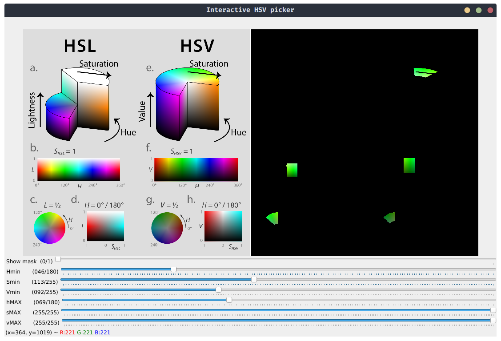

# interactive-hsv-picker

Little Python program to interactively find the best values for your HSV filter. Nothing new.

*Example: finding color green*


>*All credit for the `hsv_reference.png` image goes to [Jacob Rus](https://en.wikipedia.org/wiki/User:Jacobolus), I simply found it on [this Wikipedia page](https://en.wikipedia.org/wiki/HSL_and_HSV).*

## Usage

The program accepts three optional arguments:

- `--image=<src_image_path>` : if specified, uses the image in `<src_image_path>` instead of opening the webcam.
- `--device=<device_index>` : index of the capturing device (default=0 for webcam).
- `--show-mask` : if specified, also display the binary mask produced by the HSV filter.

### Examples

```bash
python3 interactive-hsv-picker.py   # uses the webcam
python3 interactive-hsv-picker.py --image='hsv_reference.png'   # uses the specified image
python3 interactive-hsv-picker.py --image='hsv_reference.png' --show-mask   # also display the mask
```
